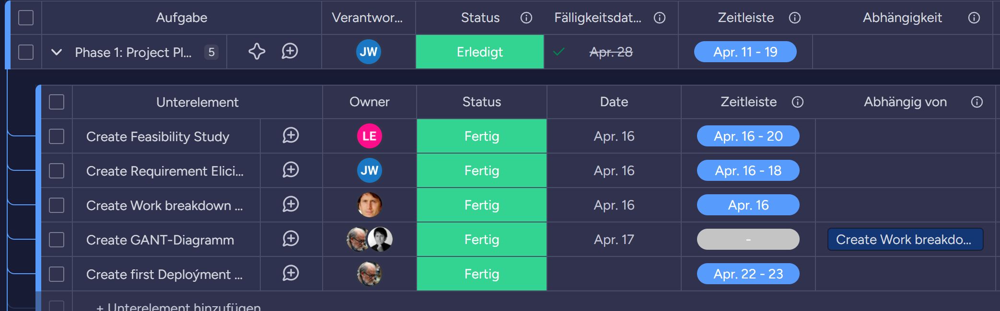
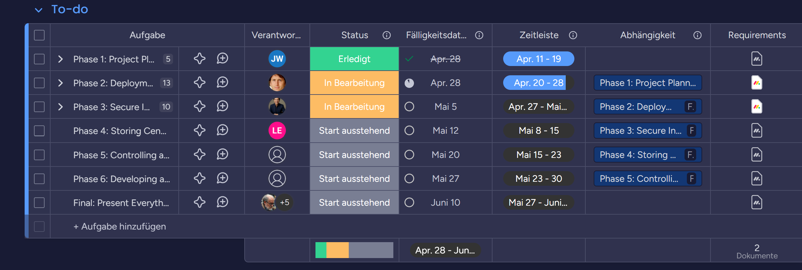
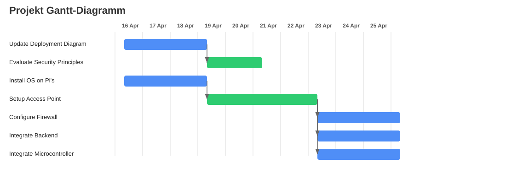
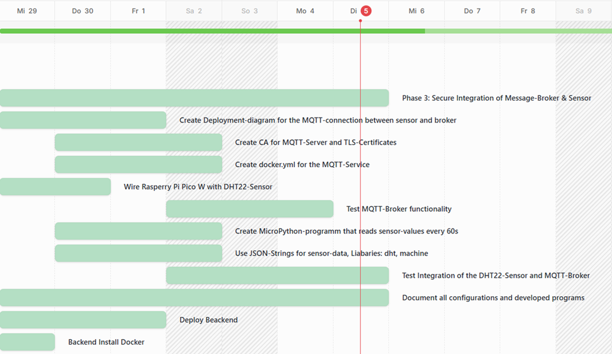
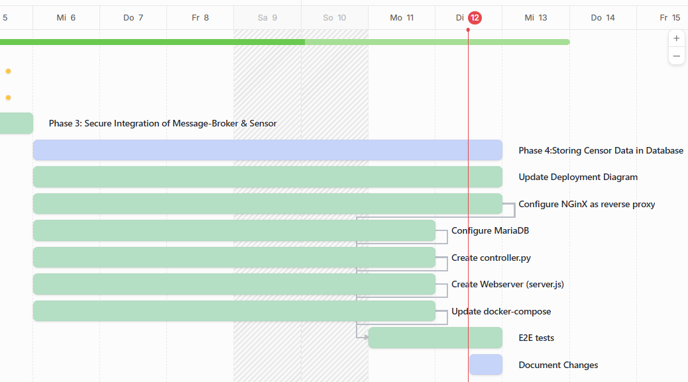
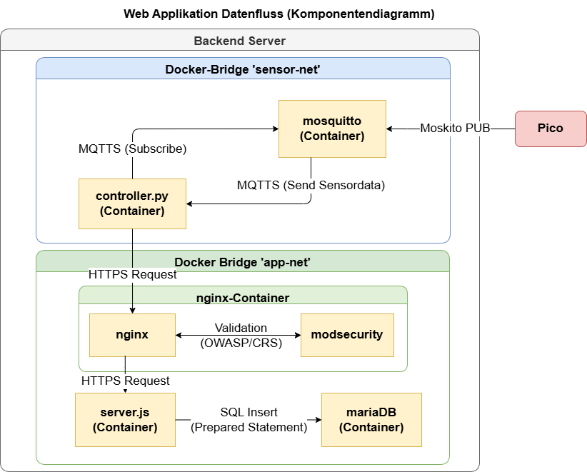
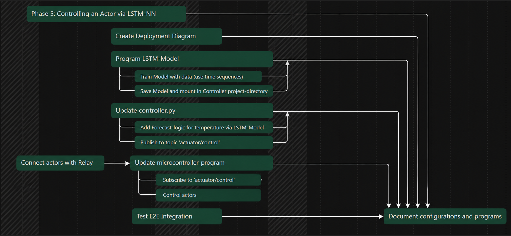
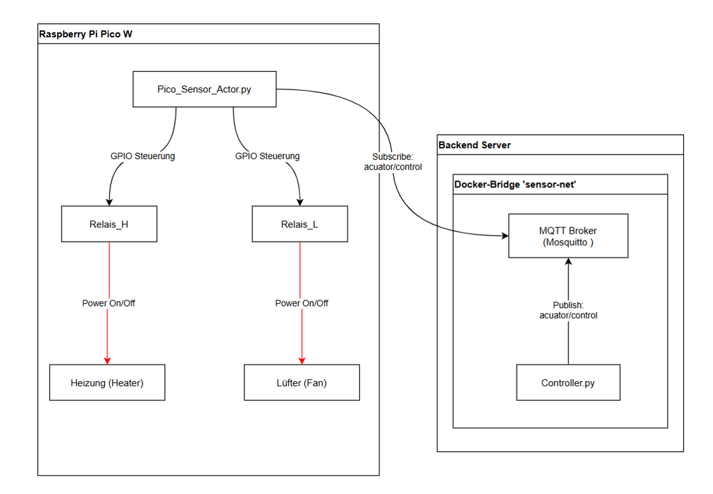
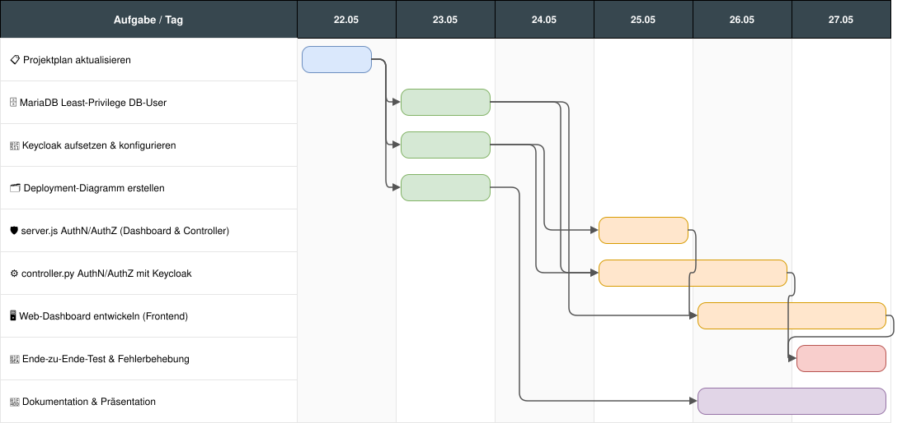
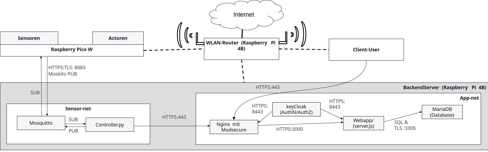

# Temperatur- und Luftfeuchtigkeitsregulierer

In diesem Projekt wurde ein Regulierungssystem für Luftfeuchtigkeit und Temperatur entwickelt, dass die Messdaten sicher
speichert und für einen authentifizierten Nutzer die Messdaten der letzten Woche visualisiert.  
Die Anforderungen für das Endprodukt waren die folgenden:

*
*

Zur Erarbeitung des
Projekts wurde dieses in die folgenden 6 Phasen eingeteilt:

1. Planung und Einteilung der folgenden Phasen
2. Erstellen eines WLAN Access Points mit Firewall
3. Verdrahtung des Pico und Übertragen der Sensordaten an das Backend
4. Sicheres Speichern der Sensordaten in der Datenbank
5. Steuerung der Aktoren des Pico mittels LSTM-Netz
6. Erstellen einer sicheren Web Applikation für die Sensordaten

## Phasen (Patchnotes)

Die Präsentationen zu den einzelnen Phasen sind als PDF im jeweiligen Verzeichnis zu
finden.  
Im Folgenden sind die konkreten Änderungen während der einzelnen Phasen aufgegliedert:

### Phase 1:

Datum: 11.04.2026 - 23.04.2026  
Problemstellung: Planung des Projektes und dessen 6 Phasen  
Verantwortlicher: Jannis Weber  
Projektplan: 

| Datei                                                    | Änderung | Erklärung                                                                           |
|----------------------------------------------------------|----------|-------------------------------------------------------------------------------------|
| [AnwendungInfoEli.pdf](Phase_1/AnwendungInfoEli.pdf)     | N/A      | Beschreibung der Anwendung und Projektidee mit Zielsetzung und Rahmenbedingungen    |
| [Machbarkeitstudie1.pdf](Phase_1/Machbarkeitstudie1.pdf) | N/A      | Machbarkeitsstudie zur technischen und wirtschaftlichen Umsetzbarkeit des Projektes |
| [6Phasen.png](Phase_1/6Phasen.png)                       | N/A      | Erstmalige Verteilung der ersten Phasen                                             |

Plan für die nächsten Phasen:  

### Phase 2:

Datum: 11.04.2026 - 28.04.2026  
Problemstellung: Deployment der Kern-Infrastruktur  
Verantwortlicher: Benjamin Hager  
GANT-Diagramm:

Deployment-Diagramm:

| Datei                           | Änderung                                                                                                                   | Erklärung                                                                                                                                                                                                                                                                             |
|---------------------------------|----------------------------------------------------------------------------------------------------------------------------|---------------------------------------------------------------------------------------------------------------------------------------------------------------------------------------------------------------------------------------------------------------------------------------|
| configurations/wlan_ap_setup.py | Neu erstellt, danach mehrfach überarbeitet (Firewall-Regeln korrigiert, SSH auf allen Interfaces erlaubt, Quellen ergänzt) | Python-Skript zur Einrichtung eines WLAN-Access-Points auf dem Raspberry Pi: konfiguriert hostapd, dnsmasq, statische IP (192.168.4.1), IP-Forwarding und nftables-Firewall mit NAT (Masquerading über eth0). Ermöglicht das Produktionsnetzwerk "Production" für IoT-Clients.        |
| configurations/pico_main.py     | Neu erstellt, danach erweitert (Phase 2 Integration)                                                                       | MicroPython-Skript für den Raspberry Pi Pico W: verbindet sich als WLAN-Client mit dem Produktionsnetzwerk, ruft die Außentemperatur aus Friedrichshafen via Open-Meteo-API ab und steuert die Onboard-LED (Blinkrate abhängig von Temperatur: <10°C → 2s, ≤25°C → 1s, >25°C → 0.3s). |
| pico_wlan_connection.txt        | Neu erstellt, danach angepasst                                                                                             | Dokumentation/Notizen zur WLAN-Konfiguration des Pico W (SSID, Passwort, Verbindungsaufbau).                                                                                                                                                                                          |

### Phase 3:

Datum: 29.04.2026 - 05.05.2026  
Problemstellung: Sichere Übertragung der Sensordaten an MQTT  
Verantwortlicher: Walter neer  
GANT-Diagramm:

| Datei                                   | Änderung                                          | Erklärung                                                                                                                                      |
|-----------------------------------------|---------------------------------------------------|------------------------------------------------------------------------------------------------------------------------------------------------|
| configurations/pico_main.py             | In Module aufgeteilt                              | Aufgrund von Erweiterungen des Codes, für die Übersichtlichkeit in Module mit eigener Zuständigkeit aufgeteilt                                 |
| configurations/pico/iot_config.py       | Neu                                               | Enthält alle Variablen für die Konfiguration von MQTT, CA und WLAN                                                                             |
| configurations/pico/control.py          | Neu                                               | Initialisierung der Pico Pins und Zuweisung an Sensor und Aktoren                                                                              |
| configurations/pico/wifi.py             | Neu                                               | Zuständig für Konfiguration und Aufbau einer WLAN-Verbindung                                                                                   |
| configurations/pico/mqtt.py             | Neu                                               | Zuständig für Konfiguration, Verarbeitung und Aufbau einer MQTT-Verbindung mit CA                                                              |
| configurations/pico/states.py           | Neu                                               | Steuert Aktoren je nach erhaltener Anweisung mit Zustandsinformation                                                                           |
| configurations/pico/main.py             | Neu                                               | Hauptdatei des Pico, wird als erstes ausgeführt und ist für den Programmablauf verantwortlich                                                  |
| configurations/pico/lib/picozero        | Schon in Phase 2 enthalten                        | Bibliothek für die Ansteuerung der On-Board-LED des Pico                                                                                       |
| configurations/pico/lib/umqtt           | Neu                                               | Bibliothek für MQTT relevante Funktionen, enthält simple.py und robust.py                                                                      |
| configurations/pico/lib/lcd_api.py      | Neu                                               | Basisklasse für den Aufbau einer I2C-Verbindung                                                                                                |
| configurations/pico/lib/pico_i2c_lcd.py | Neu                                               | Enthält Methoden für das Ansteuern eines LCD-Displays über den Pico, verwendet die Basisklasse aus lcd_api.py                                  |
| CA/ca.key                               | Neu                                               | Private Schlüsseldatei der CA, zum signieren von Zertifikaten                                                                                  |
| CA/ca.srl                               | Neu                                               | Seriennummerndatei der CA, enthält Seriennummern von signierten Zertifikaten                                                                   |
| CA/ca.crt                               | Neu                                               | Öffentliches Zertifikat der CA, zum prüfen der Signatur anderer Zertifikate                                                                    |
| CA/ca.der                               | Neu                                               | Wie ca.crt aber als Binärdatei statt Text, damit der Pico damit arbeiten kann                                                                  |
| CA/req.cnf                              | Neu                                               | Konfigurationsdatei für OpenSSL mit Einstellungen für beispielsweise Erweiterungen (weitere Hostnamen), wird für mqtt.csr und ca.crt verwendet |
| CA/mqtt.key                             | Neu                                               | Privater Schlüssel des MQTT-Servers, wird für TLS-Verschlüsselung benutzt                                                                      |
| CA/mqtt.csr                             | Neu                                               | Wird aus mqtt.key erzeugt, für das Erhalten eines Zertifikats vom CA                                                                           |
| CA/mqtt.crt                             | Neu                                               | Signiertes Zertifikat des MQTT-Brokers, vom ca.key signiert, Beweis für Clients, dass das Zertifikat über CA gültig ist                        |
| docker-compose.yml                      | Neu, Konfiguration für mqtt-Container hinzugefügt | Konfiguration mit eclipse-mosquitto Image und Port 8883, benötigte volumes gemountet                                                           |
| mosquitto/config/mosquitto.conf         | Neu                                               | Konfigurationsdatei für den MQTT-Broker                                                                                                        |
| mosquitto/log/mosquitto.log             | Neu                                               | Logdatei für den MQTT-Broker                                                                                                                   |
| mosquitto/secure/acl                    | Neu                                               | Angelegte Nutzer und deren Zugriffsrechte auf topics                                                                                           |
| mosquitto/secure/pwfile                 | Neu                                               | Existierende Nutzer und deren verschlüsselte Zugangsdaten                                                                                      |

### Phase 4:

Datum: 06.05.2026 - 12.05.2026  
Problemstellung: Sichere Übermittlung der Sensordaten und Speicherung in der Datenbank  
Verantwortlicher: Lennart Esch  
GANT-Diagramm:
  
Deployment-Diagramm:  

| Datei                      | Änderung                                         | Erklärung                                                                                                                                                                                                                                                                                                                                                                                                                             |
|----------------------------|--------------------------------------------------|---------------------------------------------------------------------------------------------------------------------------------------------------------------------------------------------------------------------------------------------------------------------------------------------------------------------------------------------------------------------------------------------------------------------------------------|
| controller/config.py       | Neu                                              | Liest Environment Variablen aus der Dockerfile                                                                                                                                                                                                                                                                                                                                                                                        |
| controller/controller.py   | Neu                                              | Main Datei des controllers                                                                                                                                                                                                                                                                                                                                                                                                            |
| controller/Dockerfile      | Neu                                              | Dockerfile, um aus dem Controller ein Image zu bauen, enthält die definierten Environment Variablen                                                                                                                                                                                                                                                                                                                                   |
| controller/https_client.py | Neu                                              | Verwendet die Request Library um https requests zu schicken; wird verwendet für das Weiterleiten der Daten an nginx                                                                                                                                                                                                                                                                                                                   |
| controller/mqtt_handler.py | Neu                                              | Verwendet die paho_mqtt Library um beim mqtt-Broker zu subscriben, definiert ein Event, das ausgelöst wird wenn eine Nachricht vom Broker eingeht                                                                                                                                                                                                                                                                                     |
| controller/validation.py   | Neu                                              | Kontrolliert, ob die vom Broker erhaltene Nachricht valides JSON ist und prüft, ob die Werte plausibel sind (wird relevant, wenn der Pico angesteurt werden soll)                                                                                                                                                                                                                                                                     |
| nginx/nginx.conf           | Neu                                              | Konfiguration von nginx, reverse Proxy von https local.data.kleber zum webapp server und redirect von http auf https                                                                                                                                                                                                                                                                                                                  |
| webapp/Dockerfile          | Neu                                              | Dockerfile zum Bau eines Images für den webserver                                                                                                                                                                                                                                                                                                                                                                                     |
| webapp/package.json        | Neu                                              | Node Standard-Konfigurationsdatei für den webserver                                                                                                                                                                                                                                                                                                                                                                                   |
| webapp/package-lock.json   | Neu                                              | Node Standard-Konfigurationsdatei für den webserver                                                                                                                                                                                                                                                                                                                                                                                   |
| webapp/server.js           | Neu                                              | Controller + Service-Layer für den webserver, enthält POST-Endpunkt zum Empfangen von neuen Messdaten und anlegen neuer Messwerte in der Datenbank                                                                                                                                                                                                                                                                                    |
| webapp/config/database.js  | Neu                                              | Erzeugt einen Connection-Pool für den Datenbank Zugriff, der von ´server.js´ verwendet wird                                                                                                                                                                                                                                                                                                                                           |
| mariadb/01_tables.sql      | Neu                                              | Initialscript für die Datenbank; legt die Tabellen für Messwerte und Messwertarchiv an                                                                                                                                                                                                                                                                                                                                                |
| mariadb/02_archive_job.sql | Neu                                              | Initialscript für die Datenbank; legt den Archivierungsjob an; es werden täglich alle Daten, die älter als eine Woche sind von `sensor-data` zum `sensor-data-archive` verschoben                                                                                                                                                                                                                                                     |
| mariadb/03_user.sql        | Neu                                              | Initialscript für die Datenbank; legt einen Nutzer mit Schreibrechten für `sensor-data` an                                                                                                                                                                                                                                                                                                                                            |
| docker-compose.yml         | Konfiguration für die neuen Services hinzugefügt | Datenbank Konfiguration mit Health-Check und Verweiß auf die Entry Point Skripte hinzugefügt Nginx Configuration basierend auf dem OWASP Image hinzugefügt, enthält bereits Schutzmaßnahmen gegen Cross-Site-Scripting, SQL-Injektion und Directory Traversal Webapp Konfiguration basierend auf dem Image aus der Dockerfile hinzugefügt Controller Konfiguration basierend auf dem Image aus der Dockerfile hinzugefügt |

### Phase 5:

Datum: 13.05.2026 - 21.05.2026  
Problemstellung: Steuerung eines Aktors mittels LSTM-Neuronales Netz  
Verantwortlicher: Tim Dorozynski  
GANT-Diagramm:
  
Deployment-Diagramm:  

| Datei                              | Änderung                                                  | Erklärung                                                                                                                                                                              |
|------------------------------------|-----------------------------------------------------------|----------------------------------------------------------------------------------------------------------------------------------------------------------------------------------------|
| controller/lstm_handler.py         | Neu                                                       | Lädt das trainierte LSTM-Modell und stellt Funktionen zur Verfügung, um Vorhersagen zu treffen; wird verwendet, um den optimalen Aktor-Wert basierend auf Sensor-Eingaben zu berechnen |
| controller/train.keras             | Neu                                                       | Trainiertes Keras/TensorFlow LSTM-Modell; Gewichte und Architektur für die Vorhersage des optimalen Regelwertes                                                                        |
| controller/train.py                | Neu                                                       | Trainingsscript für das LSTM-Modell; verwendet historische Messdaten um das Netz zu trainieren                                                                                         |
| controller/model_trainer.py        | Neu                                                       | Modulare Trainingsfunktionen für das LSTM-Modell; ermöglicht automatisches Retraining basierend auf neuen Daten                                                                        |
| controller/data_generation.py      | Neu                                                       | Generiert Trainingsdaten aus historischen Sensor-Messwerten; bereitet Daten für das LSTM-Training auf                                                                                  |
| controller/lstm_weights.weights.h5 | Neu                                                       | Exportierte Gewichte des trainierten LSTM-Modells; ermöglicht schnelleres Laden des Modells ohne Retraining                                                                            |
| configurations/pico/control.py     | Neu                                                       | Stellt Funktionen zur Ansteuerung des physischen Aktors (z.B. Heizung/Lüfter) bereit; implementiert PWM-Steuerung oder digitale Schaltausgänge                                         |
| configurations/pico/states.py      | Neu                                                       | Verwaltet die Zustände des Systems und des Aktors; definiert die möglichen Aktor-Positionen und deren Bedeutung                                                                        |
| docker-compose.yml                 | LSTM-Umgebungsvariablen im Controller-Service hinzugefügt | Ermöglicht Konfiguration des LSTM-Modells und Trainingparameter über Umgebungsvariablen; aktiviert LSTM-Vorhersagen im Controller                                                      |
| controller/Dockerfile              | TensorFlow/Keras Dependencies hinzugefügt                 | Integriert erforderliche Python-Libraries (tensorflow, keras, numpy, scikit-learn) für LSTM-Modellverarbeitung im Container                                                            |

### Phase 6:

Datum:  22.05.2026 - 28.05.2026    
Problemstellung:  Sichere Web-Applikation (AuthN/AuthZ mit Keycloak)    
Verantwortlicher:  Barnabas Steiner    
GANT-Diagramm:    
  
Deployment-Diagramm:  

| Datei                                   | Änderung                                                                                                                    | Erklärung                                                                                                                    |
|-----------------------------------------|-----------------------------------------------------------------------------------------------------------------------------|------------------------------------------------------------------------------------------------------------------------------|
| docker-compose.yml                      | Service `keycloak_web` + Volume `keycloak_data` ergänzt, DB-Credentials in read/write getrennt, Healthchecks & `depends_on` | Integriert Keycloak als OIDC-Provider, hält dessen Daten persistent und sorgt für geordneten Startup der abhängigen Services |
| keycloak/iot-realm.json                 | Realm `iot` mit Rollen (`dashboard-user`, `admin-user`, `controller-ingest`), Benutzern und Clients angelegt                | Definiert die Sicherheitsdomäne: `dashboard-client` (Browser, PKCE) und `controller-client` (Maschine, Client-Credentials)   |
| nginx/nginx.conf                        | Route `/auth` auf Keycloak (Port 8443) + TLS-Zertifikatsprüfung, Trailing-Slash-Fix                                         | Macht Keycloak über den Reverse Proxy erreichbar und verschleiert das interne System                                         |
| mariadb/03_db_write_user.sql            | Aus `03_user.sql` umbenannt; Schreib-User `websrv_write` (INSERT, UPDATE)                                                   | Trennt schreibende DB-Zugriffe vom Lesen (Least Privilege)                                                                   |
| mariadb/06_db_read_user.sql             | Neuer Lese-User `websrv_read` mit `SELECT` auf `sensor_data`                                                                | Lese-APIs erhalten ausschließlich Leserechte                                                                                 |
| mariadb/05_training_data_privileges.sql | Privilegien an die Read/Write-Trennung angepasst                                                                            | Konsistente Rechtevergabe nach der User-Aufteilung                                                                           |
| webapp/config/database.js               | `getReadPool()` / `getWritePool()` statt einem `getPool()`                                                                  | Jeder Pool meldet sich mit eigenem DB-User an → Least Privilege auf Verbindungsebene                                         |
| webapp/server.js                        | JWKS-Client + Middleware `authenticateToken`; neuer Endpoint `GET /api/sensordata`                                          | Prüft das JWT (Signatur, Audience, Rolle `dashboard-user`); liefert Dashboard-Daten per JWT statt API-Key                    |
| webapp/package.json / package-lock.json | Dependencies `jwks-rsa` und `jsonwebtoken` ergänzt                                                                          | Bibliotheken zur serverseitigen Token-Validierung                                                                            |
| webapp/public/index.html                | Keycloak-Login-Redirect + Einbindung lokaler `keycloak.js`                                                                  | Leitet nicht angemeldete Nutzer zur Keycloak-Loginseite weiter                                                               |
| webapp/public/keycloak.js               | Neue lokale Kopie der Keycloak-JS-Bibliothek                                                                                | Auslieferung über die eigene App statt über eine externe Quelle                                                              |
| webapp/public/frontend.js               | Keycloak-Init + Sensordaten-Abruf per `fetch()` mit `Bearer`-Token                                                          | Initiiert AuthN/AuthZ und lädt Daten vom geschützten Endpoint                                                                |
| webapp/public/chart.js                  | Diagramm-Rendering + Live-Update implementiert                                                                              | Visualisiert Temperatur/Luftfeuchte, minütliche Aktualisierung                                                               |
| webapp/public/style.css                 | Styling-/Layout-Anpassungen                                                                                                 | Optische Gestaltung des Dashboards                                                                                           |
| webapp/Dockerfile                       | Aus Root-`Dockerfile` nach `webapp/` verschoben                                                                             | Trennt den Web-App-Build vom Projekt-Root                                                                                    |
| sensor-net/keycloak_auth.py             | Neu: Client-Credentials-Flow, Token-Cache, Rollenprüfung, Bearer-Header                                                     | Controller authentifiziert sich maschinell an Keycloak statt nur per API-Key                                                 |
| sensor-net/http_client.py               | `_build_headers()` (API-Key + Bearer); `verify=False` → `verify=CA_CERT_PATH`                                               | Zentrale Header-Erzeugung inkl. Token; echte TLS-Zertifikatsprüfung                                                          |
| sensor-net/controller.py                | `verify_role()` vor `warmstart()`; TLS-Verify aktiviert                                                                     | Beendet den Controller, wenn die geforderte Keycloak-Rolle fehlt                                                             |
| sensor-net/config.py                    | `KC_*`-Variablen (Token-URL, Client-ID/-Secret, Rolle) + `CA_CERT_PATH` ergänzt                                             | Konfigurierbare Keycloak-Parameter für den Controller                                                                        |
| sensor-net/Dockerfile                   | ENV-Defaults für die Keycloak-Variablen                                                                                     | Standardwerte für den Containerbetrieb                                                                                       |
| sensor-net/mqtt_handler.py              | Sendet Temperatur statt Prognose an `training_data`                                                                         | Korrigiert den an die Trainingsdaten übermittelten Wert                                                                      |
| configurations/wlan_ap_setup.py         | Backend unter eigenem Hostnamen im Produktions-WLAN                                                                         | Namensauflösung für den Zugriff auf das Backend                                                                              |

### Endspurt:

Liste mit übrigen Aufgaben

| Datei              | Änderung                                                                                                                                             | Erklärung                                                                                                                                                                                                                                                                                            |
|--------------------|------------------------------------------------------------------------------------------------------------------------------------------------------|------------------------------------------------------------------------------------------------------------------------------------------------------------------------------------------------------------------------------------------------------------------------------------------------------|
| CA/*               | Neugennerierung aller Zertifikate; Alle Zertifikate sind jetzt unter CA abgelegt                                                                     | Aufgrund von Schwierigkeiten bei den Zertifikaten wurden alle Zertifikate neu erstellt und befinden sich nun im CA Verzeichnis                                                                                                                                                                       |
| environment/*      | Environment Variablen wurden von der docker-compose und den Dockerfiles in dieses Verzeichnis nach dem Namensschema [container_name].env ausgelagert | Die Environment Dateien sind jetzt an einem Ort gebündelt;  Es war geplant die Applikation so zu gestalten, dass die Änderungen in den environment Dateien reichen, um alle notwendigen Änderungen auf das gesammte Projekt auszuweiten;  Aus Zeitdruck wurde das leider nicht mehr erreicht |
| docker-compose.yml | Anpassung an obere Änderungen; docker-compose stellt den Services die Zertifikate jetzt über volumes zur Verfügung                                   | Die Zertifikate lagen vorher als Kopie im jeweiligen Verzeichnis, in dem sie gebraucht wurden;  Jetzt werden die Zertifikate nur unter CA abgelegt und von der docker-compose als volumes in die Container gemounted                                                                             |

## Projektstruktur

Erstellt mit MS-DOS `tree`

    Anwendungsprojekt.Inf
    │   docker-compose.yml
    │   README.md
    │
    ├───CA
    │       (Zertifikate und Dateien zum anlegen)
    │
    ├───configurations
    │   │   wlan_ap_setup.py
    │   │
    │   └───pico
    │           (Dateien des Pico)
    │
    ├───controller
    │   │   (Hauptdateien des Controller)
    │   │
    │   └───weights
    │          (Gewichte für das LSTM-Netzwerk)
    │   
    │
    ├───documentation
    │       (Dokumentation)
    │
    ├───environment
    │       (Dateien für die Umgebungsvariablen der einzelnen Services)
    │
    ├───keycloak
    │   └───iot-realm.json
    │
    ├───mariadb
    │       (Initialisierungsskripte für die Datenbank)
    │
    ├───mosquitto
    │   ├───config
    │   │       mosquitto.conf
    │   │
    │   ├───log
    │   │       mosquitto.log
    │   │
    │   └───secure
    │           acl
    │           pwfile
    │
    ├───nginx
    │       nginx.conf
    │
    ├───tests/E2E-tests
    │       (Testdateien für die Ende zu Ende Tests)
    │
    └───webapp
         │   (Hauptdateien für den Webserver)
         │
         └───public
                 (Öffentliche Dateien für den Client)

## Deployment Diagramm

## Beschreibung der Komponenten

### CA

CA steht für Certificate authority. In diesem Verzeichnis liegen alle verwendeten Zertifikate. Alle verwendeten
Zertifikate sind selbstsigniert.

### configurations

Unter configurations sind alle Dateien abgelegt, die nicht für das Backend benötigt werden.  
Hier liegen das Script für den WLAN-Access-Point und unter pico die Dateien des Pico.

#### pico

Steuert Aktoren über Pins an, liefert Spannungsversorgung für den Sensor und liest Sensordaten aus.
Sendet Sensordaten über MQTT an den MQTT-Broker, liest vom controller gesendete Steuerbefehle über den MQTT-Broker.

#### wlan_ap_setup.py

### controller

Empfängt Sensordaten vom MQTT-Broker, validiert und leitet sie per HTTPS an das Backend weiter.
Erstellt mithilfe eines LSTM-Modells Vorhersagen und publiziert Steuerungsbefehle (`COOL`, `HEAT`, `DRY`, `HUM`) an den
Pico.
Authentifiziert sich per Keycloak Client Credentials Flow mit der Rolle `controller-ingest`.

#### `config.py`

Liest alle Betriebsparameter (MQTT, Backend-URL, Keycloak, Schwellenwerte) aus Environment-Variablen und konfiguriert
das Logging.

#### `controller.py`

Einstiegspunkt des Controllers. Prüft beim Start die Keycloak-Authentifizierung und startet den MQTT-Loop.

#### `keycloak_auth.py`

Holt und cached das Keycloak Access-Token per Client Credentials Flow und prüft ob die Rolle `controller-ingest`
enthalten ist.

#### `mqtt_handler.py`

Baut den MQTT-Client auf und verarbeitet eingehende Nachrichten: Validierung, Weiterleitung ans Backend, LSTM-Vorhersage
und Publish der Steuerungsbefehle auf `actuator/control`.

#### `https_client.py`

Leitet Sensordaten per HTTPS-POST an das Backend weiter, mit API-Key und Bearer-Token im Header.

#### `validation.py`

Prüft eingehende MQTT-Nachrichten auf gültiges JSON, vorhandene Felder und plausible Wertebereiche.

#### `lstm_handler.py`

Lädt das trainierte LSTM-Modell und erstellt Vorhersagen basierend auf den letzten 10 Messwerten.

#### `model_trainer.py`

Trainingsscript für das LSTM-Modell. Liest CSV-Daten, erstellt Sliding-Window-Sequenzen und trainiert das Modell.

#### `data_generation.py`

Generiert synthetische Trainingsdaten (30 Tage, Minutentakt) mit simulierter Thermostat-Logik.

### environment

Enthält die Umgebungsvariablen für die Services. Es war geplant, dass durch eine Änderung an dieser Stelle alle
benötigten Änderungen für alle Services automatisch durchgeführt werden, aber wegen Zeitknappheit konnte dies leider
nicht mehr implementiert werden. Probleme waren besonders die Zertifikate, die durch ein Skript neu generiert werden
müssten.

### keycloak

### mariadb

Hier liegen die Entrypoint Skripte für den Datenbank-Container. In diesen Skripten werden:
* Tabellen für Sensordaten und ein Archiv angelegt
* Ein Job konfiguriert, der einmal täglich alle Messwerte, die älter als eine Woche sind ins Archiv verschiebt
* Nutzerrechte vergibt für einen iot-schreiber-, client-reader- und admin-export-Nutzer

### mosquitto

Hier liegen die Konfigurationsdateien für den mosquitto-broker.  
Unter config liegt die allgemeine Konfiguration, in der Port, Autorisierungsdateien und Zertifikate angegeben werden.  
Unter log liegt eine leere log-file, die von mqtt nach dem Start verwendet wird.  
Unter secure liegen die Anmeldedaten für mqtt.

### nginx

### webapp

#### config/database.js

In dieser Datei sind Pools für die jeweiligen Datenbanknutzer definiert.
Hier speziell für den Read-, Write- und Adminuser.

#### public

Dieser Ordner beinhaltet alle Frontendelemente für das Anzeigen des Dashboardes.

- **css** — Verwendete CSS-Elemente
- **external** — Extern importierte Skripte
- **img** — Bilddateien
- **js** — Verwendete Skripte
- **index.html** — HTML-Element für das Dashboard

#### service/authentication.js

Beinhaltet Middleware und Funktion für die Access Token Validierung
Speziell geprüft wird das Vorhandensein des Tokens und die erwarteten Audiences und Rollen.
Darüberhinaus ist der Endpoint für die Authentifizierung des API-Keys für die Datenbankzugriffe definiert.

#### service/validateSensorPayload.js

Beinhaltet Funktion um Übertragunsinhalt der Sensoren (Temperatur, Luftfeuchtigkeit, Zeitstempel) zu validieren.
Es wird speziell geprüft:

1. Sind Temperatur und Luftfeuchtigkeit als Zahlen vertreten
2. Ist das Format des Zeitstempels valide
3. Sind Temperatur und Luftfeuchtigkeit innerhalb des definierten Bereiches
4. Ist der Zeitstempel aktuell

Damit werden korrekte Einträge in der Datenbank gewährleistet.

#### server.js

Hauptkomponente des zum Starten des Webservers. Beinhaltet ebenfalls API für Lese- und Schreibzugriffe auf die
Datenbank.
Gegebene Endpoints:

- **GET /api/status** — Serverstatus abfragen
- **GET /api/sensordata** — Aktuellste Sensordaten erhalten
- **GET /api/sensordata/range** — Sensordaten von einem bestimmten Zeitfenster erhalten
- **GET /api/admin/export** — Aktuelle und Archivierte Sensordaten als CSV erhalten
- **POST /api/internal/sensordata** — Sensordaten in Datenbank schreiben

### E2E-tests

End-to-End-Tests, die die gesamte Pipeline vom MQTT-Publish bis zur Datenbank bzw. zum Dashboard abdecken.

#### Test 1: Sensordaten → Datenbank (Happy Path)

    MQTT-Nachricht publizieren → Broker → controller.py → HTTP POST an Backend → Wert in MariaDB prüfen

- Simulierte MQTT-Nachricht `{"temperature": 17.77, "humidity": 44.33}` auf `sensor/data` publishen
- Warten bis der Wert durch die Pipeline fließt
- Prüfen: Ist der Wert im Zeitfenster über `/api/sensordata/range` auffindbar?

#### Test 2: Keycloak AuthN/AuthZ (Token-Flow)

    Controller holt Token → JWT dekodieren → Rolle prüfen → Request mit Bearer Header → Backend akzeptiert

- Client Credentials Flow: Token von Keycloak mit `controller-client` holen
- Prüfen: Hat das JWT die Rolle `controller-ingest` in `realm_access.roles`?
- Prüfen: Akzeptiert `/api/sensordata` einen Request nur mit Bearer Token?

#### Test 3: Unauthentifizierte Requests werden abgelehnt

    Request ohne Auth → nginx → server.js → 401/403 Rejected

- POST ohne jegliche Header → erwartet 401
- POST mit falschem API-Key → erwartet 401
- GET ohne Bearer Token → erwartet 401
- GET mit ungültigem Bearer Token → erwartet 403

#### Test 4: Ungültige Sensordaten werden verworfen

    Ungültige MQTT-Nachricht → Broker → controller.py (verwirft) → kein neuer Eintrag in DB

- 5 verschiedene ungültige Payloads publishen (fehlende Felder, falscher Typ, leerer String, kein JSON, Extremwerte)
- Warten bis Pipeline verarbeitet hätte
- Prüfen: Kein neuer Eintrag in der Datenbank seit Testbeginn

#### Test 5: Aktor-Steuerung bei hoher Temperatur

    MQTT "sensor/data" (35°C) → controller.py → LSTM-Modell → MQTT "actuator/control" = "COOL"

- 15 Nachrichten mit `temperature: 35.0` publishen um den LSTM-Buffer zu füllen
- Gleichzeitig auf `actuator/control` Topic subscriben
- Prüfen: Kommt ein `COOL`-Befehl vom Controller zurück?

#### Test 6: TLS-Zertifikatsvalidierung

    HTTPS-Request → nginx (mit CA-Zertifikat validiert)

- Prüfen: CA-Zertifikatsdatei existiert auf dem System
- Prüfen: HTTPS-Verbindung mit korrektem CA-Zertifikat funktioniert
- Prüfen: HTTPS-Verbindung mit falschem Zertifikat wird abgelehnt (SSLError)

#### Test 7: Dashboard-Zugriff (Rollenbasiert)

    User → Keycloak (Login + Token) → nginx → server.js → Rolle prüfen → Zugriff erlauben/verweigern

- 7a: Admin-User (`admin-user` + `dashboard-user`) → 200 auf `/api/sensordata` + 200 auf `/api/admin/export`
- 7b: Normaler User (`dashboard-user`) → 200 auf `/api/sensordata` + 403 auf `/api/admin/export`
- 7c: User ohne Rolle (`testuser_norole`) → 403 auf `/api/sensordata`

## Installation und Inbetriebnahme

### Pi Setup

* Installiere das Raspberry Pi light Image auf beiden Pis
* Lies die MAC-Addresse eines Pis aus; dieser Pi wird später zum Backend

### WLAN AP

* Verbinde den WLAN Pi über ein Netzwerkkabel mit dem Internet
* Stelle eine Verbindung zum Pi via ssh her
* Setze backend_mac_address in Zeile 4 in `/conficuration/wlan_ap_setup.py` auf die MAC-Addresse des Backends
* Führe `sudo apt install hostapd dnsmasq` auf dem Pi aus
* Kopiere jetzt das Skript `wlan_ap_setup.py` auf den Pi und führe es mit root-Rechten aus

### Pi Pico

* Verbinde den Pi Pico über Micro-USB an USB-A/USB-C eines Endgerätes mit Thonny:
    1. BOOTSEL-Taste (weiße Taste auf Pico) gedrückt halten
    2. An Entwicklungs-Endgerät per USB-Kabel anschließen
    3. .uf2-Datei mit der MicroPython-Firmware auf das Laufwerk "RPI-RP2" per Drag und Drop kopieren.
    4. Pico startet neu
* Danach kann der Pi Pico immer wieder eingesteckt und Thonny geöffnet werden
* Der Pi Pico verbindet sich dann automatisch mit Thonny
* main.py auswählen und "Run current script" Button klicken um zu starten
* Bei Spannungsversorgung ohne Datenfluss (zum Beispiel Pico direkt über USB-Kabel an Netzteil) startet main.py
  automatisch

### Backend server

* Verbinde dich über ssh mit dem Backend
* Verbinde dich mit `nmtui` mit dem WiFi:
    1. Führe `nmtui` aus
    2. Wähle "Activate a connection"
    3. Wähle das Netzwerk aus und gebe das Passwort ein (Standard: Production, Production-01)
* Klone das Repository auf das Backend
* Installiere Docker Compose
* Zum Starten der Software führe jetzt `sudo docker compose up` im Projektverzeichnis aus

## Bedienung

Die Applikation lässt sich mit `sudo docker compose up/down` starten und beenden.  
Vor dem Start ist sicherzustellen, dass der WLAN-AP Pi hochgefahren und funktionstüchtig ist (z.B. indem geprüft wird,
ob das Backend ´mit dem zugehörigen WLAN verbunden ist).  
Der Pico wird durch Ausführen der `main.py` gestartet.
Nach dem Start kann eine Verbindung zum Netzwerk aufgebaut werden und
unter [https://local.kleber.data](https://local.kleber.data) das Web Dashboard besucht werden.  
Hier folgt eine Anmeldung mit [iotuser01]: [password] oder [admin]: [admin].  
Danach wird das Dashboard angezeigt.
Als Admin besteht außerdem die Möglichkeit alle Sensordaten als CSV-Datei zu exportieren.

## E2E-tests Ergebnisse

## Fazit

## Literatur und Hilfsmittel

https://projects.raspberrypi.org/en/projects/getting-started-with-the-pico/3
Zugriff: 18.04.2026
Pico W firmware

https://pip-assets.raspberrypi.com/categories/686-raspberry-pi-pico-w/documents/RP-008312-DS-1-pico-w-datasheet.pdf?disposition=inline
Zugriff: 18.04.2026
Pico W datasheet

https://docs.micropython.org/en/latest/rp2/quickref.html
Zugriff: 24.04.2026
RP2 code reference

https://github.com/micropython/micropython-lib/blob/master/micropython/umqtt.simple/example_sub.py
Zugriff: 18.05.2026
umqtt reference

https://www.drawio.com/
Zugriff 10.06.2026
Deployment-Diagramme

FreeCAD 1.0.2: Erstellung der 3D-Modelle und technischen Zeichnungen
InkScape: Erstellung LOGO.svg
draw.io: Erstellung Schaltplan
Bambu Studio: 3D-Modelle für den Druck slicen
Bambu Lab P1S-Drucker: Drucken der 3D-Modelle